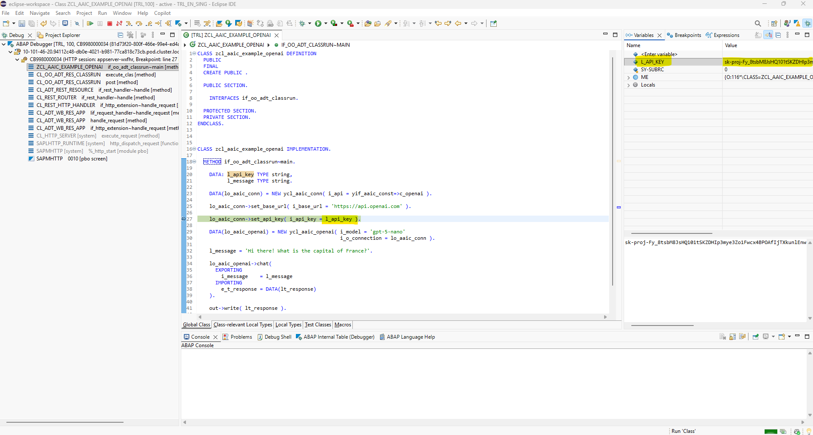
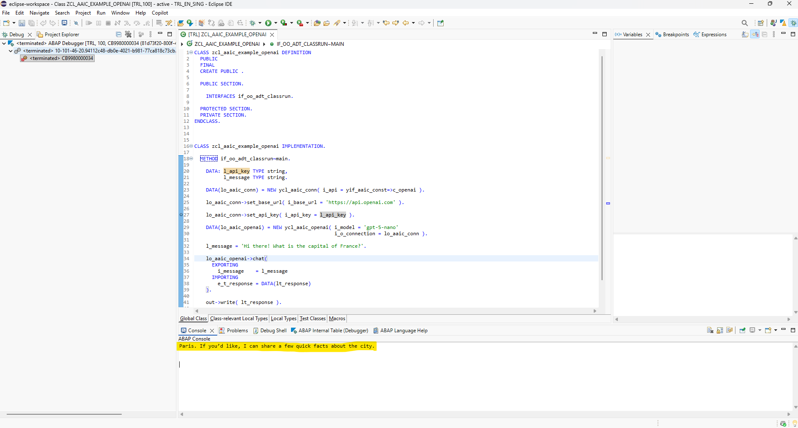

# yaai_cloud - ABAP AI tools Cloud
This repository provides a set of tools designed to facilitate Artificial Intelligence capabilities within **ABAP Cloud** environments.

## Key Features
- **Multi-Provider LLM API Support**: ABAP AI tools Cloud support seamless integration with multiple large language model APIs, giving you flexibility in choosing your provider and deployment model. The list of supported APIs will continue to grow as the project evolves. Currently supported APIs include:
  - **[OpenAI](docs/openai/README.md)**
  - **[Google Gemini](docs/google/README.md)**
  - **[Anthropic](docs/anthropic/README.md)** 
  - APIs from other providers, such as Mistral, that implement the OpenAI API standards also work with ABAP AI tools Could, possibly requiring minor adjustments.
    - **[Mistral](docs/openai_compatible/mistral.md)** (cloud-based)
- **Conversation Management**: Maintain and manage multi-turn conversations, with full access to conversation history for advanced chat scenarios.
- **Tool/Function Calling**: Integrate ABAP business logic with LLMs using function/tool calling, allowing AI models to trigger ABAP methods.
- **Retrieval-Augmented Generation (RAG)**: Enhance LLM outputs by incorporating enterprise data, enabling more accurate and relevant answers through retrieval-augmented generation workflows.

These features empower you to build intelligent, enterprise-ready ABAP applications that leverage the latest advancements in AI.

  **Disclaimer:** ABAP AI tools Cloud is experimental and released under the MIT License. It is provided "as is", without warranty of any kind, express or implied. This means you use these tools at your own risk, and the authors are not liable for any damages or issues arising from their use.

## Prerequisites
 - **SAP ABAP Cloud**: You need an SAP BTP ABAP environment or SAP S/4HANA Cloud ABAP environment (a.k.a. Embedded Steampunk) .
 - **abapGit**: Ensure that `abapGit Repositories Eclipse ADT Plug-In` is installed. You can find all information on the SAP Help website: https://help.sap.com/docs/btp/sap-business-technology-platform/working-with-abapgit?locale=en-US

## Installation
You can install the ABAP AI tools Cloud into your ABAP Cloud system using abapGit. The BTP ABAP environment comes with a preinstalled official SAP distribution of abapGit.

**Steps:**
1. Create a package named `YAAI_CLOUD` (or choose a different name if you prefer 😉);
2. Open the abapGit Repositories view and click the button with the plus sign (Link new abapGit Repository...):

   

4. Enter the URL `https://github.com/christianjianelli/yaai_cloud.git`:

   

5. Specify the package:

   

6. Click the **Finish** button:

   

6. Right-click the package and select **Pull** to import the repository content:

   

7. Activate the imported objects as needed.

You have now successfully installed the `ABAP AI tools Cloud`.

## Quickstart

### Running Your First ABAP AI Cloud Application

This quickstart demonstrates how to create a simple LLM application. It shows you how to connect to the LLM and perform a basic chat interaction.

**Requirements:** 
*   You have a valid OpenAI API Key.

**Steps:**
1.  Create an ABAP AI Connection instance;
2.  Set the Base URL;
3.  Set the API Key;
4.  Create an ABAP AI OpenAI instance;
5.  Call the CHAT method.

**Example:**
```abap
CLASS zcl_aaic_example_openai DEFINITION
  PUBLIC
  FINAL
  CREATE PUBLIC.

  PUBLIC SECTION.

    INTERFACES if_oo_adt_classrun.

  PROTECTED SECTION.
  PRIVATE SECTION.
ENDCLASS.

CLASS zcl_aaic_example_openai IMPLEMENTATION.

  METHOD if_oo_adt_classrun~main.

    DATA: l_api_key TYPE string,
          l_message TYPE string.

    DATA(lo_aaic_conn) = NEW ycl_aaic_conn( i_api = yif_aaic_const=>c_openai ).

    lo_aaic_conn->set_base_url( i_base_url = 'https://api.openai.com' ).
    
    lo_aaic_conn->set_api_key( i_api_key = l_api_key ).

    DATA(lo_aaic_openai) = NEW ycl_aaic_openai( i_model = 'gpt-5-nano'
                                                i_o_connection = lo_aaic_conn ).

    l_message = 'Hi there! What is the capital of France?'.

    lo_aaic_openai->chat(
      EXPORTING
        i_message    = l_message
      IMPORTING
        e_t_response = DATA(lt_response)
    ).

    out->write( lt_response ).

  ENDMETHOD.

ENDCLASS.
``` 

**How to run:**
1. Set a breakpoint on the `set_api_key` method call (`lo_aaic_conn->set_api_key( i_api_key = l_api_key ).`).
2. Press F9 to execute the code.
3. In the debugger, set the value of the variable `l_api_key` to your actual API key.
4. Press F8 to continue execution.

**ABAP Debugger:**



**Result (ABAP Console view):**




## User Interface - ABAP AI Chat
In a BTP ABAP environment, the user interface must be a web application. ABAP AI tools Cloud includes a basic chat interface that you can use immediately or create a copy and modify it to fit your requirements.

While ABAP AI tools Cloud does not directly provide a SAPUI5 or SAP Fiori Elements chat user interface, this documentation explains how to integrate an ABAP AI chat into a SAPUI5 Freestyle application or a SAP Fiori Elements application.

### HTTP Services
ABAP AI tools Cloud provides several HTTP services, each offering a basic chat user interface for interacting with different LLM providers and models.

**Available Chat UIs:**
1. **OpenAI Chat UI** – Interact with OpenAI models through a simple web-based chat interface.
2. **Anthropic Chat UI** – Communicate with Anthropic models using a dedicated chat UI.
3. **Google Gemini Chat UI** – Access Google Gemini models via an integrated chat interface.
4. **Mistral Chat UI** – Connect to Mistral models with a compatible chat UI.

You can use these UIs as-is, or create a copy and modify it to fit your specific requirements.

### SAPUI5 Freestyle Application
Since SAPUI5 does not have dedicated controls to build a chat interface we need to build a custom one. This documentation provides instructions and code for adding a basic chat interface to a SAPUI5 Freestyle application. It is a simple starting point so you can quickly connect your app to the ABAP AI tools.   

### SAP Fiori Elements Application
Adding a chat to a SAP Fiori Elements Application is a more complex task. It requires a controller extension. 


## Next Steps

  Now that you've run your first ABAP AI Cloud applications, consider exploring additional features. 😊

  ### Read the documentation

  - [ABAP AI tools Cloud Documentation](docs/README.md)

  ### Choose Your API:

  To get started with your preferred API, check out the dedicated guides:

  - [OpenAI Guide](docs/openai/README.md): Learn how to use ABAP AI with OpenAI models.
  - [Google Gemini Guide](docs/google/README.md): Learn how to use ABAP AI with Google Gemini models.
  - [Anthropic](docs/anthropic/README.md): Learn how to use ABAP AI with Anthropic models.
  - [Mistral](docs/openai_compatible/mistral.md): Learn how to use ABAP AI with Mistral models.