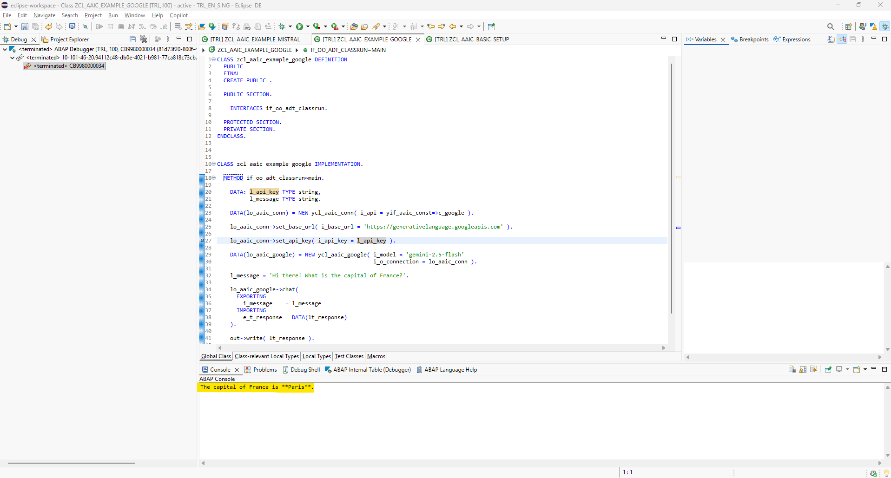

# yaai_cloud - ABAP AI tools Cloud - Google Gemini

<p>
  
</p>

## Google Gemini Quickstart

### Running Your First ABAP AI Cloud Google Gemini Application

This quickstart demonstrates how to create a simple LLM application. It shows you how to connect to the LLM and perform a basic chat interaction.

**Requirements:** 
*   You have a valid Google Gemini API Key.

**Steps:**
1.  Create an ABAP AI Connection instance;
2.  Set the Base URL;
3.  Set the API Key;
4.  Create an ABAP AI Google Gemini instance;
5.  Call the CHAT method.

**Example:**
```abap

``` 

**How to run:**
1. Set a breakpoint on the `set_api_key` method call (`lo_aaic_conn->set_api_key( i_api_key = l_api_key ).`).
2. Press F9 to execute the code.
3. In the debugger, set the value of the variable `l_api_key` to your actual API key.
4. Press F8 to continue execution.

**ABAP Debugger:**


**Result (ABAP Console view):**

