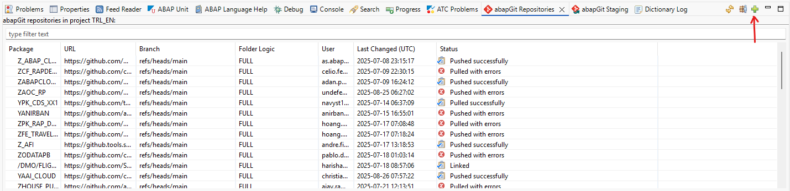
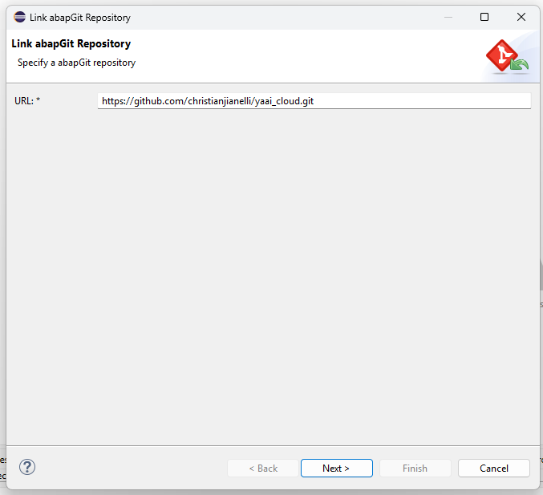
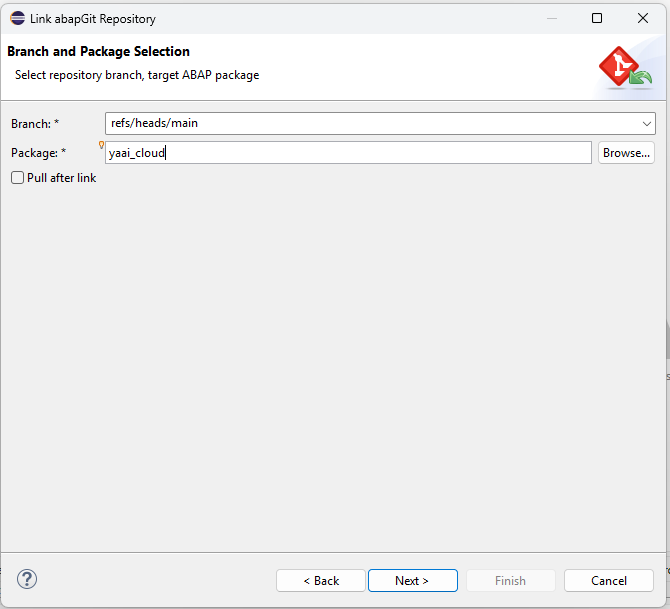
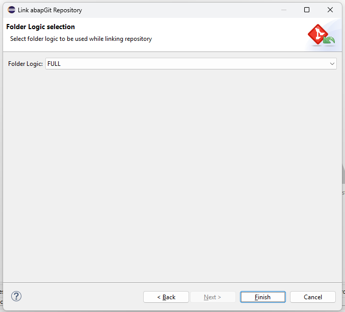
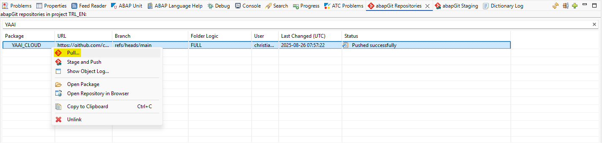

# yaai_cloud - ABAP AI tools Cloud - Installation
You can install the ABAP AI tools into your SAP system using abapGit. 

## Installation
You can install the ABAP AI tools Cloud into your ABAP Cloud system using abapGit. The BTP ABAP environment comes with a preinstalled official SAP distribution of abapGit.

  **Disclaimer:** ABAP AI tools Cloud is experimental and released under the MIT License. It is provided "as is", without warranty of any kind, express or implied. This means you use these tools at your own risk, and the authors are not liable for any damages or issues arising from their use.

## Prerequisites
 - **SAP ABAP Cloud**: You need an SAP BTP ABAP environment or SAP S/4HANA Cloud ABAP environment (a.k.a. Embedded Steampunk) .
 - **abapGit**: Ensure that `abapGit Repositories Eclipse ADT Plug-In` is installed. You can find all information on the SAP Help website: https://help.sap.com/docs/btp/sap-business-technology-platform/working-with-abapgit?locale=en-US

## Installation Steps

1. Create a package named `YAAI_CLOUD` (or choose a different name if you prefer 😉);

2. Open the abapGit Repositories view and click the button with the plus sign (Link new abapGit Repository...):

   

4. Inform the URL `https://github.com/christianjianelli/yaai_cloud.git`:

   

5. Inform the package:

   

6. Click the **Finish** button:

   

6. Right-click the package and select **Pull** to import the repository content:

   

7. Activate the imported objects as needed.

    You have now successfully installed the `ABAP AI tools Cloud` 😊.