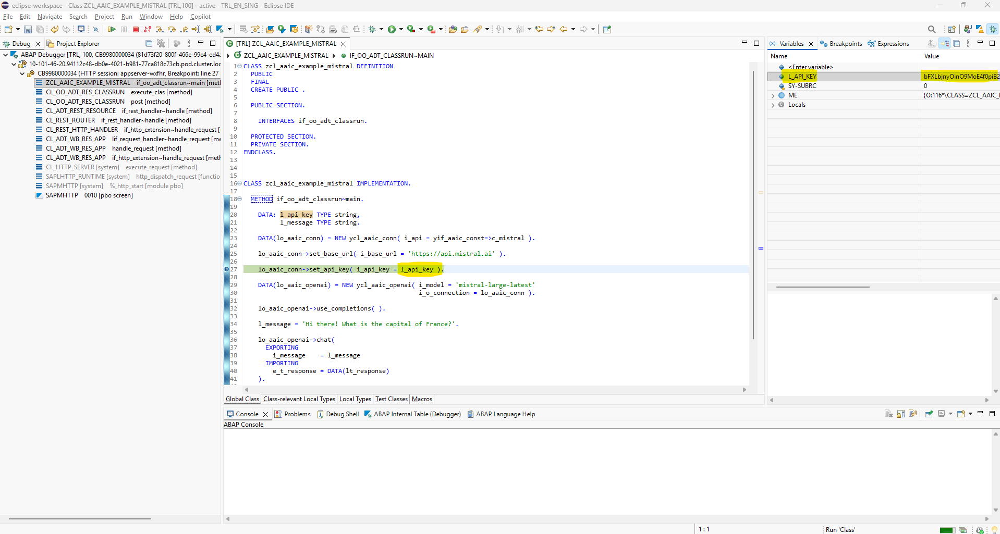
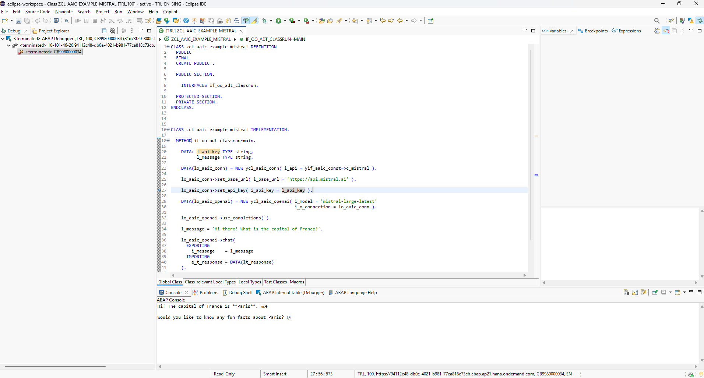

# yaai_cloud - ABAP AI tools Cloud - Mistral

<p>
  
</p>

## Mistral Quickstart

### Running Your First ABAP AI Cloud Mistral Application

This quickstart demonstrates how to create a simple LLM application. It shows you how to connect to the LLM and perform a basic chat interaction.

**Requirements:** 
*   You have a valid Mistral API Key.

**Steps:**
1.  Create an ABAP AI Connection instance;
2.  Set the Base URL;
3.  Set the API Key;
4.  Create an ABAP AI OpenAI instance;
5.  Call the CHAT method.

**Example:**
```abap
CLASS zcl_aaic_example_mistral DEFINITION
  PUBLIC
  FINAL
  CREATE PUBLIC .

  PUBLIC SECTION.

    INTERFACES if_oo_adt_classrun.

  PROTECTED SECTION.
  PRIVATE SECTION.
ENDCLASS.


CLASS zcl_aaic_example_mistral IMPLEMENTATION.

  METHOD if_oo_adt_classrun~main.

    DATA: l_api_key TYPE string,
          l_message TYPE string.

    DATA(lo_aaic_conn) = NEW ycl_aaic_conn( i_api = yif_aaic_const=>c_mistral ).

    lo_aaic_conn->set_base_url( i_base_url = 'https://api.mistral.ai' ).

    lo_aaic_conn->set_api_key( i_api_key = l_api_key ).

    DATA(lo_aaic_openai) = NEW ycl_aaic_openai( i_model = 'mistral-large-latest'
                                                i_o_connection = lo_aaic_conn ).

    lo_aaic_openai->use_completions( ).

    l_message = 'Hi there! What is the capital of France?'.

    lo_aaic_openai->chat(
      EXPORTING
        i_message    = l_message
      IMPORTING
        e_t_response = DATA(lt_response)
    ).

    out->write( lt_response ).

  ENDMETHOD.

ENDCLASS.
``` 

**How to run:**
1. Set a breakpoint on the `set_api_key` method call (`lo_aaic_conn->set_api_key( i_api_key = l_api_key ).`).
2. Press F9 to execute the code.
3. In the debugger, set the value of the variable `l_api_key` to your actual API key.
4. Press F8 to continue execution.

**ABAP Debugger:**



**Result (ABAP Console view):**

