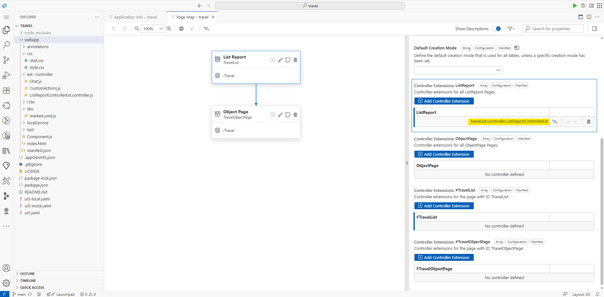
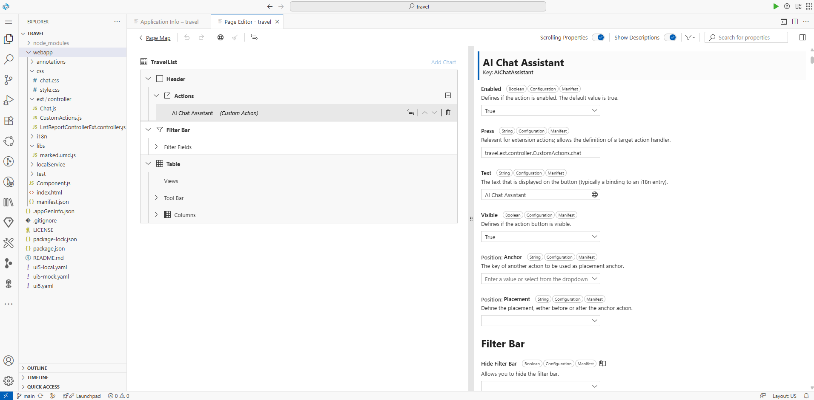
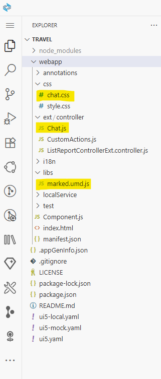
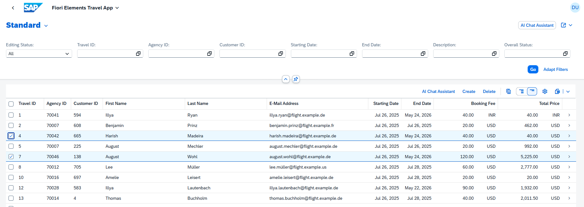
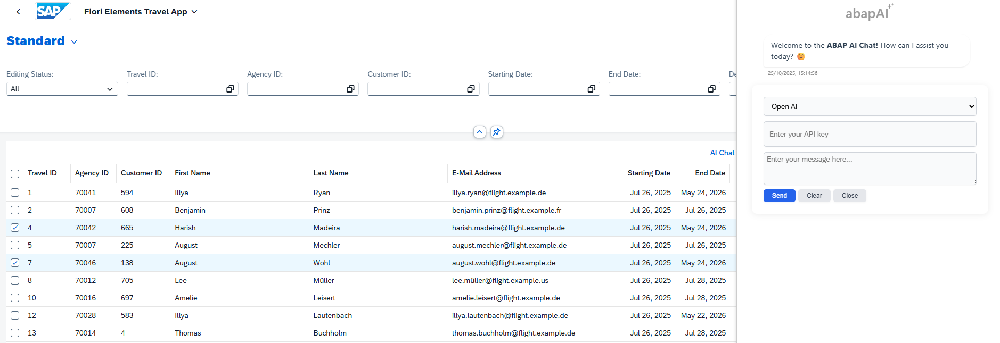
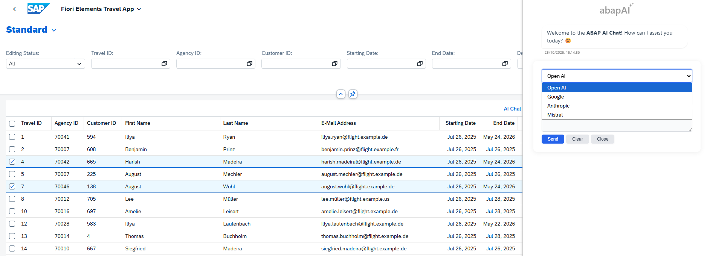
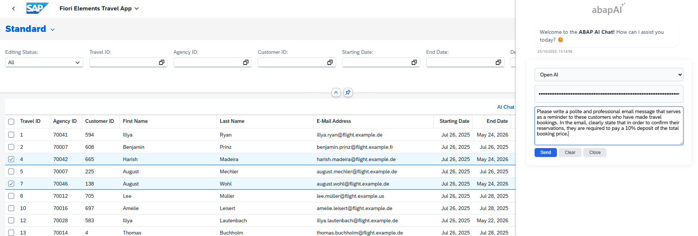
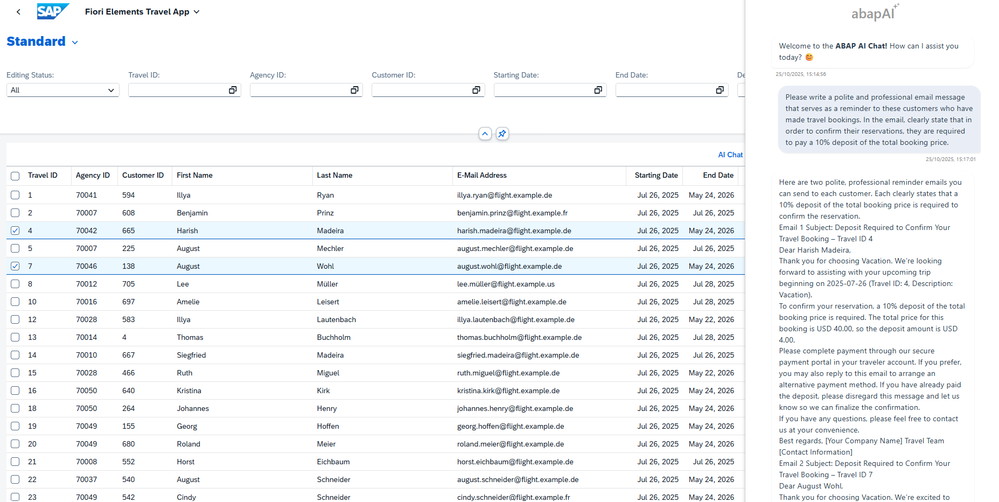
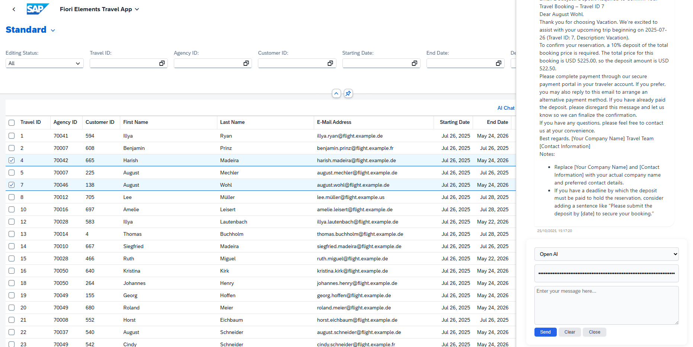

# yaai_cloud - ABAP AI Tools Cloud - SAP Fiori Elements

## SAP Fiori Elements Application Integration

This app demonstrates how to integrate ABAP AI tool cloud capabilities into SAP Fiori Elements Applications.

> **Note:**  
> SAPUI5 does not include dedicated controls for building a chat interface. A custom solution is required.  
> This documentation provides the steps for implementing a custom chat UI within your SAP Fiori Elements Application.

> **Source Code Repository:** 
> https://github.com/christianjianelli/yaai_cloud_fiori

---

## Overview of Chat Integration

The custom chat solution is built using several key components:

- **`Chat.js`**: Contains all core chat functionality.
- **`chat.css`**: Custom CSS file for chat styles.
- **`marked.umd.js`**: Markdown parser for LLM-generated content.

---

## Integration Steps

### 1. Add a Controller Extension to the List Report

Example: `ListReportControllerExt.controller.js`



---

### 2. Add a Custom Action to Trigger the Chat Interface



---

### 3. Upload Custom Files

Upload the following files:

- `Chat.js`
- `chat.css`
- `marked.umd.js`



---

### 4. Add the chat.css to the manifest.json
Locate the `"resources"` section in your `manifest.json` file and add an entry for `chat.css` to ensure your custom chat styles are loaded:

```json
"resources": {
    "css": [
        {
            "uri": "css/style.css"
        },
        {
            "uri": "css/chat.css"
        }
    ]
}
```

---

### 5. Add Chat.js Module Dependency

**CustomActions.js**
```javascript
sap.ui.define([
    "travel/ext/controller/Chat"
], function(Chat) {
    'use strict';
    // ...existing code...
});
```

**ListReportControllerExt.controller.js**
```javascript
sap.ui.define([
    "sap/ui/core/mvc/ControllerExtension",
    "travel/ext/controller/Chat"
], function (ControllerExtension, Chat) {
    'use strict';
    // ...existing code...
});
```

---

### 6. Call `Chat.onToggleChat()` from the Custom Action Event Handler

**CustomActions.js**
```javascript
sap.ui.define([
    "travel/ext/controller/Chat"
], function(Chat) {
    'use strict';

    return {
        /**
         * Generated event handler.
         *
         * @param oContext The context of the page on which the event was fired. `undefined` for list report page.
         * @param aSelectedContexts The selected contexts of the table rows.
         */
        chat: function(oContext, aSelectedContexts) {
            Chat.onToggleChat();
        }
    };
});
```

---

### 7. Set Up Context Retrieval Functionality

Implement `getAppContext` in the controller extension to provide chat with necessary data (e.g., Travel ID, Description, customer details).

**ListReportControllerExt.controller.js**
```javascript
sap.ui.define([
    "sap/ui/core/mvc/ControllerExtension",
    "travel/ext/controller/Chat"
], function (ControllerExtension, Chat) {
    'use strict';

    return ControllerExtension.extend('travel.ext.controller.MyControllerExtension', {

        getAppContext: function () {
            let sContext = "";
            const aContext = this.base.getExtensionAPI().getSelectedContexts();

            for (const element of aContext) {
                sContext += "Travel Info" +
                    "\n Travel Id: " + element.getProperty("TravelID") +
                    "\n Description: " + element.getProperty("Description") +
                    "\n Customer Id: " + element.getProperty("CustomerID") +
                    "\n Customer Name: " + element.getProperty("CustomerFirstName") + " " + element.getProperty("CustomerLastName") +
                    "\n Customer Email: " + element.getProperty("CustomerEmail") +
                    "\n Begin Date: " + element.getProperty("BeginDate") +
                    "\n Booking Fee: " + element.getProperty("BookingFee") +
                    "\n Total Price: " + element.getProperty("TotalPrice") +
                    "\n Currency: " + element.getProperty("CurrencyCode") +
                    "\n\n";
            }

            console.log(sContext);
            return sContext;
        },
        // ...existing code...
    });
});
```

---

### 8. Initialize the Chat in `onAfterRendering`

Call `Chat.setContextProvider()` and `Chat.setChatHTMLContent()` in the `onAfterRendering` hook.

**ListReportControllerExt.controller.js**
```javascript
sap.ui.define([
    "sap/ui/core/mvc/ControllerExtension",
    "travel/ext/controller/Chat"
], function (ControllerExtension, Chat) {
    'use strict';

    return ControllerExtension.extend('travel.ext.controller.MyControllerExtension', {
        // ...existing code...

        override: {
            /**
             * Called when a controller is instantiated and its View controls (if available) are already created.
             * Can be used to modify the View before it is displayed, to bind event handlers and do other one-time initialization.
             * @memberOf travel.ext.controller.MyControllerExtension
             */
            onInit: function () {
                // Access the Fiori elements extensionAPI via this.base.getExtensionAPI
                // var oModel = this.base.getExtensionAPI().getModel();
            },

            onAfterRendering: function() {
                Chat.setContextProvider(this.getAppContext.bind(this));
                Chat.setChatHTMLContent(this.getView());
            }
        }
    });
});
```

---

### 9. Run the Application

Run the application. Select one or more travel records, then open the AI Chat Assistant. Choose your preferred API, enter your API key, type your prompt, and send it to interact with the assistant.











