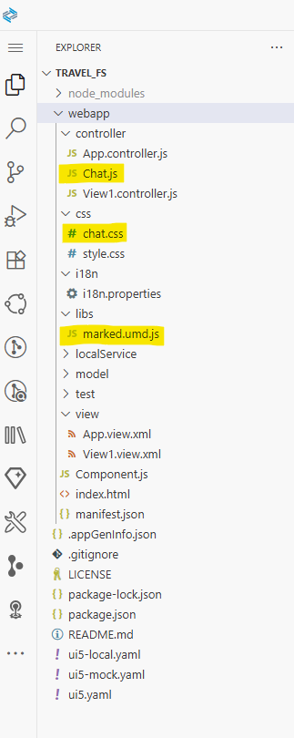
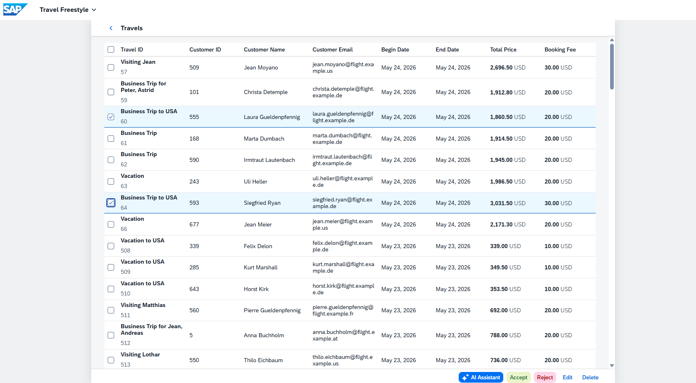
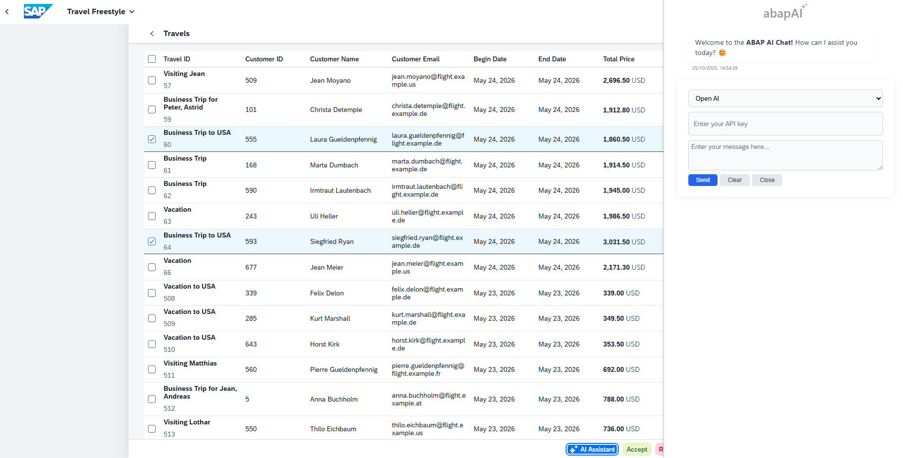
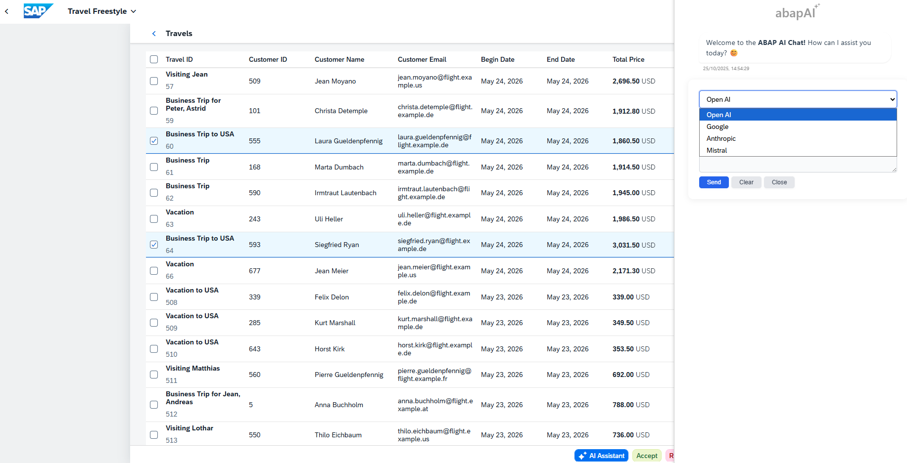
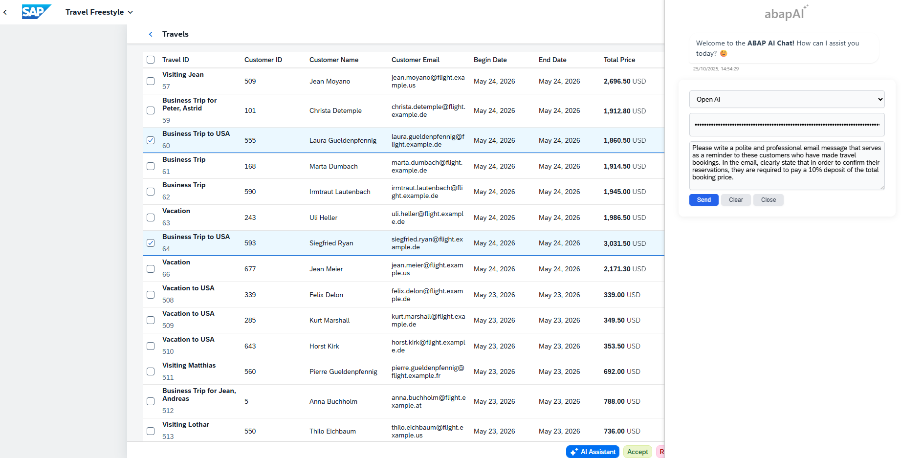
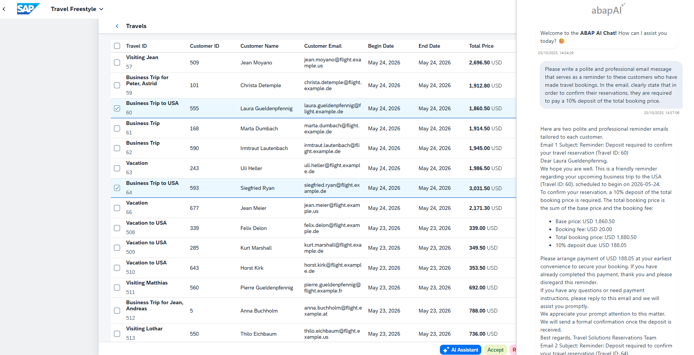

# yaai_cloud - ABAP AI tools Cloud - Freestyle SAPUI5 Application

## SAP Fiori Elements Application Integration

This app demonstrates how to integrate ABAP AI tool cloud capabilities into Freestyle SAPUI5 Applications.

> **Note:**  
> SAPUI5 does not include dedicated controls for building a chat interface. A custom solution is required.  
> This documentation provides the steps for implementing a custom chat UI within your SAP Fiori Elements Application.

> **Source Code Repository:** 
> https://github.com/christianjianelli/yaai_cloud_fiori_fs

---

## Overview of Chat Integration

The custom chat solution is built using several key components:

- **`Chat.js`**: Contains all core chat functionality.
- **`chat.css`**: Custom CSS file for chat styles.
- **`marked.umd.js`**: Markdown parser for LLM-generated content.

---

## Integration Steps

### 1. Upload Custom Files

Upload the following files:

- `Chat.js`
- `chat.css`
- `marked.umd.js`



---

### 2. Add the chat.css to the manifest.json
Locate the `"resources"` section in your `manifest.json` file and add an entry for `chat.css` to ensure your custom chat styles are loaded:

```json
"resources": {
    "css": [
        {
            "uri": "css/style.css"
        },
        {
            "uri": "css/chat.css"
        }
    ]
}
```

---

### 3. Add Chat.js Module Dependency

**View1.controller.js**

```javascript
sap.ui.define([
    "sap/ui/core/mvc/Controller",
    "travelfs/controller/Chat"
], (Controller, Chat) => {
    "use strict";

    return Controller.extend("travelfs.controller.View1", {
        
        onInit() {
        }

    });
});
```

---

### 4. Set Up Context Retrieval Functionality

Implement `getAppContext` in the view controller to provide chat with necessary data (e.g., Travel ID, Description, customer details).

```javascript
sap.ui.define([
    "sap/ui/core/mvc/Controller",
    "travelfs/controller/Chat"
], (Controller, Chat) => {
    "use strict";

    return Controller.extend("travelfs.controller.View1", {
        
        onInit() {
        },

        getAppContext: function() {
        
            let sContext = "";

            const oView = this.getView();

            const oTable = oView.byId("TravelsTable");

			const aContext = oTable.getSelectedContexts();
			
			for (const element of aContext) {

				sContext = sContext + "Travel Info" + 
				            "\n Travel Id: " + element.getProperty("TravelID") + 
							"\n Description:" + element.getProperty("Description") + 
							"\n Customer Id: " + element.getProperty("CustomerID") + 
							"\n Customer Name: " + element.getProperty("CustomerFirstName") + " " + element.getProperty("CustomerLastName") +
							"\n Customer Email: " + element.getProperty("CustomerEmail") + 
							"\n Begin Date:" + element.getProperty("BeginDate") +
							"\n Booking Fee:" + element.getProperty("BookingFee") + 
							"\n Total Price:" + element.getProperty("TotalPrice") + 
							"\n Currency:" + element.getProperty("CurrencyCode") + 
							"\n\n";
			}

			console.log(sContext);

			return sContext;
        
        }

    });
});
```

---

### 5. Initialize the Chat in `onAfterRendering` and implement the Chat Toogle

Call `Chat.setContextProvider()` and `Chat.setChatHTMLContent()` in the `onAfterRendering` hook. 
Call `Chat.onToggleChat()` inside the `onToggleChat` event handler.  
Assign this handler to a UI event, such as the `press` event of a Button, to allow users to open or close the chat interface interactively.

```javascript
sap.ui.define([
    "sap/ui/core/mvc/Controller",
    "travelfs/controller/Chat"
], (Controller, Chat) => {
    "use strict";

    return Controller.extend("travelfs.controller.View1", {
        
        onInit() {
        },

        getAppContext: function() {
        
            let sContext = "";

            const oView = this.getView();

            const oTable = oView.byId("TravelsTable");

			const aContext = oTable.getSelectedContexts();
			
			for (const element of aContext) {

				sContext = sContext + "Travel Info" + 
				            "\n Travel Id: " + element.getProperty("TravelID") + 
							"\n Description:" + element.getProperty("Description") + 
							"\n Customer Id: " + element.getProperty("CustomerID") + 
							"\n Customer Name: " + element.getProperty("CustomerFirstName") + " " + element.getProperty("CustomerLastName") +
							"\n Customer Email: " + element.getProperty("CustomerEmail") + 
							"\n Begin Date:" + element.getProperty("BeginDate") +
							"\n Booking Fee:" + element.getProperty("BookingFee") + 
							"\n Total Price:" + element.getProperty("TotalPrice") + 
							"\n Currency:" + element.getProperty("CurrencyCode") + 
							"\n\n";
			}

			console.log(sContext);

			return sContext;
        
        },

        onAfterRendering: function() {
            Chat.setContextProvider(this.getAppContext.bind(this));
            Chat.setChatHTMLContent(this.getView());
        },

        onToggleChat: function(oContext, aSelectedContexts) {
            Chat.onToggleChat();
        }
    });
});
```

---

### 6. Run the Application

Run the application. Select one or more travel records, then open the AI Chat Assistant. Choose your preferred API, enter your API key, type your prompt, and send it to interact with the assistant.










